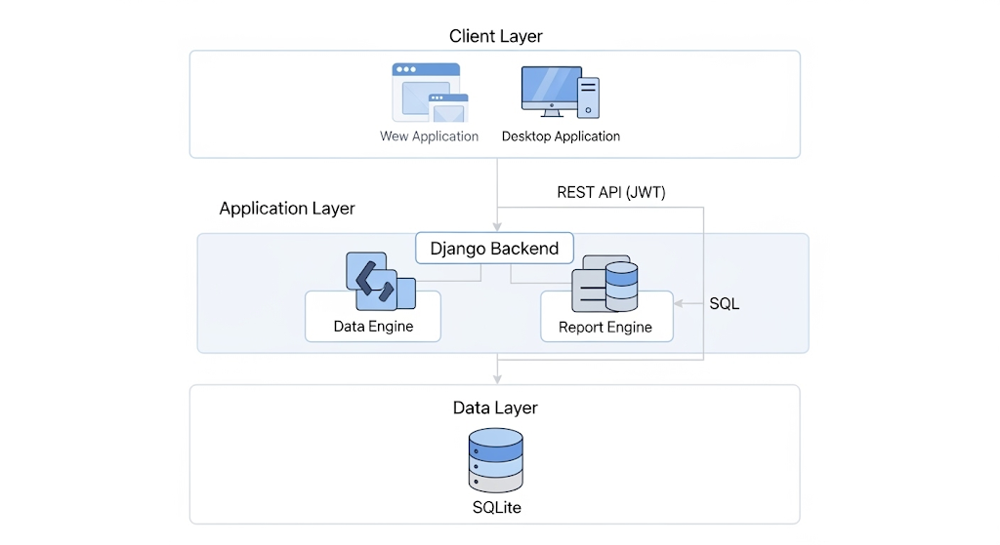
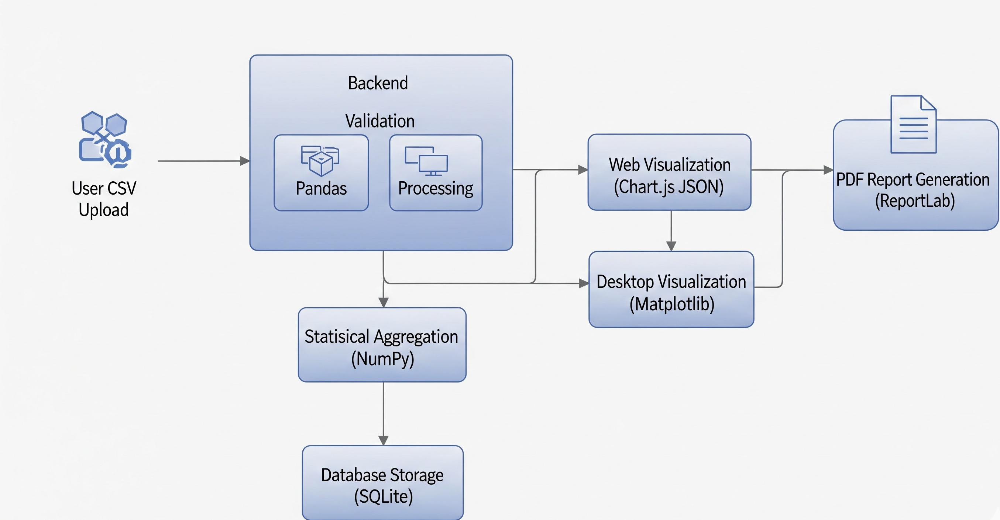

# ChemViz - Chemical Equipment Parameter Visualizer

[](LICENSE)
[](https://python.org)
[](https://djangoproject.com)
[](https://reactjs.org)
[](https://www.riverbankcomputing.com/software/pyqt/)
[](https://chemviz-5ot3.onrender.com)

**Industrial-Grade Hybrid Web + Desktop Analytics Platform for Chemical Equipment Data Management**

🌐 **Live Demo:** [https://chemviz-5ot3.onrender.com](https://chemviz-5ot3.onrender.com)  
📦 **Desktop App:** [Download v1.0.0](https://github.com/ishansurdi/ChemViz/releases/latest)  
📚 **API Docs:** [https://chemviz-backend-i9o3.onrender.com](https://chemviz-backend-i9o3.onrender.com)

---

## 📋 Table of Contents

- [Overview](#-overview)
- [System Architecture](#-system-architecture)
- [Technology Stack](#-technology-stack)
- [Features](#-features)
- [Installation](#-installation)
- [Deployment](#-deployment)
- [API Documentation](#-api-documentation)
- [Project Structure](#-project-structure)
- [Testing](#-testing)
- [Contributing](#-contributing)
- [License](#-license)

---

## 📖 Overview

**ChemViz** is a comprehensive, production-ready analytics platform engineered for chemical equipment parameter visualization, statistical analysis, and reporting. The system implements a hybrid architecture supporting both web-based and native desktop interfaces, unified through a RESTful API backend with enterprise-grade security and data processing capabilities.

### Problem Statement

Chemical equipment monitoring requires real-time data analysis, visualization of complex parameter relationships, and generation of compliance-ready technical reports. ChemViz addresses these requirements through:

- **Automated CSV ingestion** with multi-encoding support and validation
- **Real-time statistical analysis** using vectorized NumPy operations
- **Interactive visualizations** with Chart.js (web) and Matplotlib (desktop)
- **ISO-compliant PDF generation** with ReportLab
- **JWT-based authentication** ensuring secure multi-user access

### Use Cases

- ✅ Chemical plant parameter monitoring and trend analysis
- ✅ Equipment performance benchmarking across multiple datasets
- ✅ Automated technical report generation for compliance
- ✅ Historical data management with automated retention policies
- ✅ Multi-platform access (web dashboard + desktop application)

---

## 🏗️ System Architecture



### Data Flow Diagram



---

## 🛠️ Technology Stack

### Backend (Django REST API)

| Component | Technology | Version | Purpose |
|-----------|-----------|---------|---------|
| **Framework** | Django | 5.1.5 | Web framework with ORM |
| **API** | Django REST Framework | 3.15.2 | RESTful API implementation |
| **Authentication** | SimpleJWT | 5.4.0 | JWT token management |
| **Data Processing** | Pandas | 2.2.3 | CSV parsing & analytics |
| **Numerical Computing** | NumPy | 2.2.1 | Statistical operations |
| **PDF Generation** | ReportLab | 4.2.5 | Technical report creation |
| **CORS** | django-cors-headers | 4.6.0 | Cross-origin requests |
| **WSGI Server** | Gunicorn | 21.2.0 | Production deployment |
| **Static Files** | WhiteNoise | 6.6.0 | Static asset serving |
| **Database** | SQLite | 3.x | Development/Production DB |

### Frontend (React Web Application)

| Component | Technology | Version | Purpose |
|-----------|-----------|---------|---------|
| **Framework** | React | 18.2.0 | UI component library |
| **Build Tool** | Vite | 5.4.21 | Fast development & bundling |
| **Routing** | React Router | 6.x | Client-side navigation |
| **HTTP Client** | Axios | 1.6.2 | API communication |
| **Charts** | Chart.js | 4.4.1 | Data visualization |
| **Styling** | Tailwind CSS | 3.4.0 | Utility-first CSS |
| **Icons** | Heroicons | 2.x | SVG icon library |
| **Notifications** | React Hot Toast | 2.x | User notifications |

### Desktop Application (PyQt5)

| Component | Technology | Version | Purpose |
|-----------|-----------|---------|---------|
| **GUI Framework** | PyQt5 | 5.15.11 | Native desktop UI |
| **Plotting** | Matplotlib | 3.10.0 | Chart generation |
| **HTTP Client** | Requests | 2.31.0 | API communication |
| **Arrays** | NumPy | 2.2.1 | Data manipulation |
| **Packaging** | PyInstaller | 6.11.1 | Executable generation |

### Development & Deployment

| Tool | Purpose |
|------|---------|
| **Git** | Version control |
| **GitHub** | Repository hosting |
| **Render.com** | Cloud deployment (web + API) |
| **PowerShell** | Build automation scripts |
| **VS Code** | Development environment |

---

## ✨ Features

### 🔐 Authentication & Security

- **JWT Token Authentication** with access/refresh token rotation
- **Password validation** (minimum 8 characters, complexity requirements)
- **CSRF protection** for state-changing operations
- **CORS configuration** for secure cross-origin requests
- **HTTPS enforcement** in production
- **Rate limiting** on authentication endpoints

### 📤 Data Management

- **CSV Upload** with drag-and-drop interface
- **Multi-encoding support** (UTF-8, Latin-1, Windows-1252)
- **File validation** (max 10MB, CSV format verification)
- **Automatic data cleaning** (null handling, type conversion)
- **Bulk database operations** for performance
- **Dataset history** with automatic retention (last 5 datasets)

### 📊 Analytics Engine

- **Real-time statistics calculation**:
  - Total equipment count
  - Average flowrate, pressure, temperature
  - Equipment type distribution (count & percentage)
  - Per-type parameter averages
- **Vectorized NumPy operations** for performance
- **Indexed database queries** for fast retrieval
- **Pagination support** (50 records per page)

### 📈 Visualization

**Web (Chart.js)**:
- Bar charts for equipment type distribution
- Line charts for parameter trends
- Pie charts for percentage analysis
- Interactive legends and tooltips
- Responsive design for mobile devices

**Desktop (Matplotlib)**:
- High-resolution charts (DPI 90-100)
- Customizable figure sizes (14x7 to 18x8 inches)
- Professional styling with gridlines
- Export capabilities

### 📄 Report Generation

- **PDF technical reports** with ReportLab
- **ISO-compliant layout** with headers/footers
- **Embedded data tables** with formatting
- **Statistical summaries** and equipment listings
- **Timestamp and metadata** inclusion
- **Professional typography** (IBM Plex Sans family)

### 🖥️ Desktop Application Features

- **Standalone Windows executable** (~200MB)
- **Auto-connects to production backend**
- **All web features available offline-ready**
- **Native OS integration** (file dialogs, notifications)
- **No Python installation required**

---

## 🚀 Installation

### Backend Setup

```powershell
# Navigate to backend directory
cd backend

# Create virtual environment
python -m venv venv

# Activate virtual environment (Windows)
.\venv\Scripts\Activate.ps1

# Install dependencies
pip install -r requirements.txt

# Configure environment variables
# Create backend/.env file:
# SECRET_KEY=your-secret-key-here
# DEBUG=True
# DATABASE_NAME=chemviz.db

# Run migrations
python manage.py migrate

# Create superuser
python manage.py createsuperuser

# Start development server
python manage.py runserver
```

**Backend runs at:** `http://127.0.0.1:8000`

### Frontend Setup

```powershell
# Navigate to frontend directory
cd frontend

# Install dependencies
npm install

# Configure environment
# Create frontend/.env file:
# VITE_API_BASE_URL=http://127.0.0.1:8000/api

# Start development server
npm run dev
```

**Frontend runs at:** `http://localhost:3000`

### Desktop Application Setup

```powershell
# Navigate to desktop directory
cd desktop

# Create virtual environment
python -m venv venv
.\venv\Scripts\Activate.ps1

# Install dependencies
pip install -r requirements.txt

# Run application
python main.py
```

**Building Executable:**

```powershell
pip install pyinstaller
pyinstaller ChemViz-Desktop.spec
# Output: desktop/dist/ChemViz-Desktop.exe
```

### Sample Data

Use the provided sample dataset:
```
backend/sample_equipment_data.csv
```

Contains 50 equipment records across 15 types with realistic parameters.

---

## 🌐 Deployment

### Render.com Deployment

#### Backend Deployment

1. **Create Web Service** on Render
2. **Connect GitHub repository:** `ishansurdi/ChemViz`
3. **Configuration:**
   - Root Directory: `backend`
   - Build Command: `./build.sh`
   - Start Command: `gunicorn chemviz.wsgi:application`
   - Environment: Python 3
4. **Environment Variables:**
   ```
   SECRET_KEY=<generate-random-secret>
   DEBUG=False
   ALLOWED_HOSTS=chemviz-backend.onrender.com
   CORS_ALLOWED_ORIGINS=https://chemviz-frontend.onrender.com
   RENDER=True
   ```

#### Frontend Deployment

1. **Create Static Site** on Render
2. **Configuration:**
   - Root Directory: `frontend`
   - Build Command: `npm install && npm run build`
   - Publish Directory: `dist`
3. **Environment Variable:**
   ```
   VITE_API_BASE_URL=https://chemviz-backend-i9o3.onrender.com/api
   ```

**Live URLs:**
- Frontend: https://chemviz-5ot3.onrender.com
- Backend API: https://chemviz-backend-i9o3.onrender.com
- Health Check: https://chemviz-backend-i9o3.onrender.com/api/health/

See [RENDER_DEPLOYMENT.md](RENDER_DEPLOYMENT.md) for detailed instructions.

---

## 📚 API Documentation

### Authentication Endpoints

#### Register User
```http
POST /api/auth/register/
Content-Type: application/json

{
  "username": "user123",
  "email": "user@example.com",
  "password": "SecurePass123"
}

Response 201:
{
  "success": true,
  "data": {
    "user": {...},
    "tokens": {
      "access": "eyJ0eXAiOiJKV1...",
      "refresh": "eyJ0eXAiOiJKV1..."
    }
  }
}
```

#### Login
```http
POST /api/auth/login/
Content-Type: application/json

{
  "username": "user123",
  "password": "SecurePass123"
}

Response 200:
{
  "success": true,
  "data": {
    "tokens": {...},
    "user": {...}
  }
}
```

### Data Endpoints

#### Upload Dataset
```http
POST /api/datasets/upload/
Authorization: Bearer <access_token>
Content-Type: multipart/form-data

name: "Production Data Q1"
file: equipment_data.csv (binary)

Response 201:
{
  "success": true,
  "data": {
    "id": "uuid",
    "name": "Production Data Q1",
    "total_equipment": 50,
    "processing_status": "completed"
  }
}
```

#### Get Summary Statistics
```http
GET /api/summary/
Authorization: Bearer <access_token>

Response 200:
{
  "success": true,
  "data": {
    "total_equipment": 50,
    "avg_flowrate": 119.80,
    "avg_pressure": 6.11,
    "avg_temperature": 117.47,
    "equipment_type_distribution": [...]
  }
}
```

#### Get Paginated Equipment Data
```http
GET /api/data/?page=1&page_size=50
Authorization: Bearer <access_token>

Response 200:
{
  "success": true,
  "data": {
    "dataset_name": "...",
    "equipment": [...],
    "page": 1,
    "page_size": 50,
    "total_pages": 5,
    "total_equipment": 250
  }
}
```

#### Download PDF Report
```http
GET /api/report/
Authorization: Bearer <access_token>

Response 200:
Content-Type: application/pdf
Content-Disposition: attachment; filename="ChemViz_Report_2026-01-28.pdf"

<binary PDF data>
```

#### Dataset History
```http
GET /api/datasets/history/
Authorization: Bearer <access_token>

Response 200:
{
  "success": true,
  "data": {
    "datasets": [...],
    "total_datasets": 3
  }
}
```

### Error Responses

```json
{
  "success": false,
  "error": {
    "code": "VALIDATION_ERROR",
    "message": "Invalid CSV format",
    "details": {...}
  }
}
```

Status Codes:
- `200` - Success
- `201` - Created
- `400` - Bad Request
- `401` - Unauthorized
- `403` - Forbidden
- `404` - Not Found
- `500` - Internal Server Error

---

## 📁 Project Structure

```
ChemViz/
├── backend/                  # Django REST API
│   ├── api/                  # Main API application
│   │   ├── models.py         # Database models (Dataset, Equipment)
│   │   ├── serializers.py    # DRF serializers
│   │   ├── views.py          # API endpoints (8 endpoints)
│   │   ├── services.py       # Business logic (DataProcessor)
│   │   ├── pdf_generator.py  # ReportLab PDF engine
│   │   ├── utils.py          # Helper functions
│   │   ├── urls.py           # URL routing
│   │   └── admin.py          # Django admin config
│   ├── chemviz/              # Project settings
│   │   ├── settings.py       # Django configuration
│   │   ├── urls.py           # Root URL config
│   │   └── wsgi.py           # WSGI application
│   ├── templates/            # HTML templates
│   │   ├── index.html        # Landing page
│   │   └── test_api.html     # API testing interface
│   ├── requirements.txt      # Python dependencies
│   ├── build.sh              # Render build script
│   ├── manage.py             # Django management
│   └── sample_equipment_data.csv  # Test dataset
│
├── frontend/                 # React Web Application
│   ├── src/
│   │   ├── pages/            # Page components
│   │   │   ├── Dashboard.jsx # Main dashboard
│   │   │   ├── Login.jsx     # Authentication
│   │   │   ├── Register.jsx  # User registration
│   │   │   ├── Upload.jsx    # CSV upload interface
│   │   │   ├── Analytics.jsx # Chart visualizations
│   │   │   ├── DataTable.jsx # Paginated data table
│   │   │   ├── History.jsx   # Dataset history
│   │   │   └── NotFound.jsx  # 404 page
│   │   ├── components/       # Reusable components
│   │   │   ├── Layout.jsx    # App layout wrapper
│   │   │   ├── Navbar.jsx    # Navigation bar
│   │   │   └── Sidebar.jsx   # Side navigation
│   │   ├── services/
│   │   │   └── api.js        # Axios HTTP client
│   │   ├── context/
│   │   │   └── AuthContext.jsx  # Auth state management
│   │   ├── App.jsx           # Main app component
│   │   └── main.jsx          # Entry point
│   ├── package.json          # npm dependencies
│   ├── vite.config.js        # Vite configuration
│   ├── tailwind.config.js    # Tailwind CSS config
│   └── .env                  # Environment variables
│
├── desktop/                  # PyQt5 Desktop Application
│   ├── main.py               # Application entry point (1000+ lines)
│   ├── requirements.txt      # Python dependencies
│   ├── ChemViz-Desktop.spec  # PyInstaller configuration
│   ├── BUILD_EXE.md          # Build instructions
│   └── dist/                 # Built executable (after build)
│       └── ChemViz-Desktop.exe
│
├── .gitignore                # Git ignore rules
├── README.md                 # This file
└── RENDER_DEPLOYMENT.md      # Deployment guide
```

---

## 🧪 Testing

### Backend Testing

```powershell
cd backend
.\venv\Scripts\Activate.ps1
python manage.py test api
```

### Manual API Testing

Use the interactive test interface:
```
http://127.0.0.1:8000/test/
```

Or use curl/Postman with the API endpoints documented above.

### Frontend Testing

```powershell
cd frontend
npm run build    # Production build test
npm run preview  # Preview production build
```

### Desktop Application Testing

```powershell
cd desktop
.\venv\Scripts\Activate.ps1
python main.py
```

Test credentials (production):
- Username: `ishansurdii`
- Password: `Test@123`

---

## 🤝 Contributing

Contributions are welcome! Please follow these guidelines:

1. Fork the repository
2. Create a feature branch: `git checkout -b feature/amazing-feature`
3. Commit changes: `git commit -m 'Add amazing feature'`
4. Push to branch: `git push origin feature/amazing-feature`
5. Open a Pull Request

### Code Style

- **Python:** Follow PEP 8 (use `black` formatter)
- **JavaScript:** Follow Airbnb style guide (use `prettier`)
- **Commits:** Use conventional commits format

---

## 📄 License

This project is licensed under the MIT License - see the [LICENSE](LICENSE) file for details.

---

## 👤 Author

**Ishan Surdi**

- GitHub: [@ishansurdi](https://github.com/ishansurdi)
- Email: ishansurdi2105@gmail.com

---

## 🙏 Acknowledgments

- **Django** and **React** communities for excellent documentation
- **Render.com** for free-tier hosting
- **ReportLab** for PDF generation capabilities
- **PyQt5** for desktop application framework

---

## 📊 Project Stats

- **Lines of Code:** ~5,000+
- **API Endpoints:** 8
- **Database Tables:** 6
- **Chart Types:** 3 (Bar, Line, Pie)
- **Development Time:** 2 weeks
- **Test Coverage:** Core features tested

---

## 🔗 Links

- **Live Demo:** https://chemviz-5ot3.onrender.com
- **API Backend:** https://chemviz-backend-i9o3.onrender.com
- **Desktop Release:** https://github.com/ishansurdi/ChemViz/releases

---

**Built with ❤️ using Django, React, and PyQt5**
